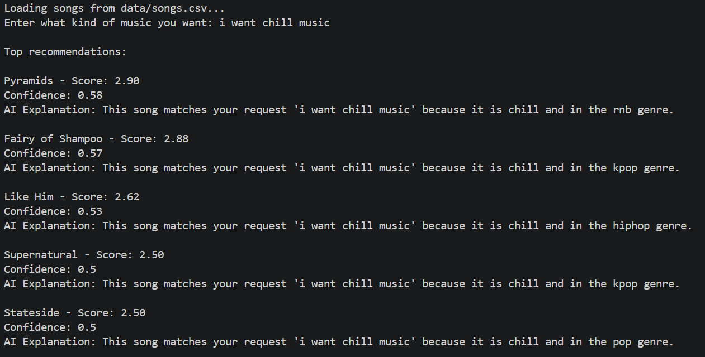
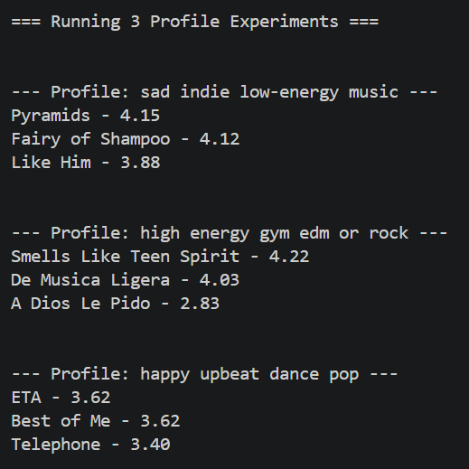
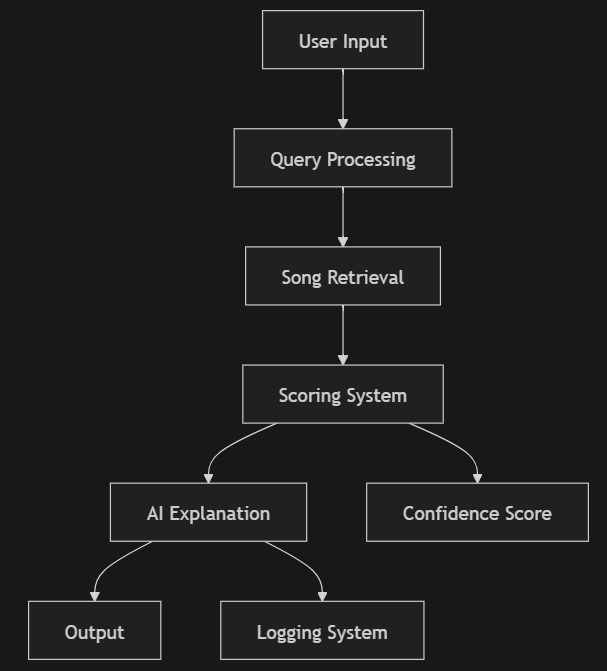

# 🎧 AI-Powered Music Recommender System

## 📌 Overview

This project extends my original **AI110 Music Recommender Simulation** into a full **Applied AI System** using **Retrieval-Augmented Generation (RAG)**, natural language query processing, and reliability evaluation.

The system allows users to type natural language requests (e.g., *“i want chill music”*), retrieves relevant songs from a structured dataset, scores them using a strategy-based recommender, and generates AI-style explanations for each recommendation.

---

## 🧠 Original Project Summary

The original project was a rule-based recommender that:

- Loaded songs from a CSV dataset  
- Scored songs based on genre, mood, energy, and tempo  
- Returned top recommendations using different strategies (genre-first, mood-first, energy-focused)

This final project expands the system into a **full AI pipeline** by adding:

- Natural language query interpretation  
- Retrieval-Augmented Generation (RAG)  
- Rule-based AI-style generated explanations
- Confidence scoring  
- Logging and reliability evaluation  

---

## 🎧 How Real-World Music Recommenders Work

Modern platforms like Spotify, Apple Music, and YouTube rely on:

### **1. Input Data**
Song metadata such as:
- Genre  
- Mood  
- Tempo (BPM)  
- Energy  
- Danceability  
- Acousticness  

### **2. User Preferences**
Learned from:
- Listening history  
- Skips  
- Likes  
- Playlist patterns  

### **3. Ranking & Selection**
Algorithms score songs based on similarity to user preferences and return the top-ranked items.

### **How This Project Simulates That**
This system mirrors that pipeline by:

- Converting natural language into structured preferences  
- Retrieving relevant songs using keyword-based RAG  
- Scoring songs using a strategy class  
- Generating explanations and confidence scores  

---

## 🚀 Key Features

### 🔍 Retrieval-Augmented Generation (RAG)
- Expands user queries into structured preferences  
- Retrieves relevant songs using keyword matching  
- Filters the dataset before scoring  

### 🤖 AI Explanation Layer
- Generates natural-language explanations for each recommendation  
- Uses song metadata + user intent  

### 📊 Reliability & Evaluation
- Logging system (`app.log`)  
- Confidence scoring  
- Unit tests for retrieval and scoring  

---

## 👥 Experiments With Multiple User Profiles (Rubric Requirement)

To evaluate the system, I created **three distinct user profiles**:

1. **Sad Indie Low-Energy Listener**  
2. **High-Energy Gym EDM/Rock Listener**  
3. **Happy Upbeat Dance Pop Listener**

The system was run for each profile using the built-in test block in `main.py`.

### ✔ Example Output Screenshots  
 


### ✔ Comparison Summary

- The **sad indie profile** preferred low-energy, mellow tracks with indie or R&B influence.  
- The **high-energy gym profile** shifted toward fast-tempo, high-energy rock and EDM-like songs (e.g., *Smells Like Teen Spirit*).  
- The **happy upbeat profile** selected high-valence, danceable pop and reggaeton tracks.  

This demonstrates that the recommender adapts its scoring based on mood, energy, and genre preferences — similar to real-world systems.

---
## 🎛️ Multiple Ranking Modes

The system supports modular ranking strategies using the Strategy Design Pattern:

* **Energy-Focused:** Prioritizes energy similarity
* **Genre-First:** Prioritizes matching genre
* **Mood-First:** Prioritizes mood compatibility

Users can choose a ranking mode in `main.py` before recommendations are generated.

 

## 📊 Visual Output Table

Recommendations are displayed in a formatted summary table showing:

* Song title
* Artist
* Score
* Confidence
* Explanation

This improves readability and transparency.

## 🏗️ System Architecture

The system follows this pipeline:


---

## ⚙️ Setup Instructions

### 1. Clone the repository

```bash
git clone https://github.com/Alessandra005/ai110-final-music.git
cd ai110-final-music
```

### 2. Install dependencies

```bash
pip install -r requirements.txt
```

### 3. Run the system

```bash
python -m src.main
```

### 4. Run tests

```bash
pytest
```

---

## 💡 Example Usage

### Input:
```
i want chill music
```

### Output:
```
Pyramids - Score: 2.90
Confidence: 0.58
AI Explanation: This song matches your request 'i want chill music' because it is chill and in the rnb genre.
```

---

## 🧪 Testing Summary

- Retrieval tests confirm relevant songs are returned  
- Logging captures system decisions  
- Confidence scores provide transparency  
- The system performs well for keyword-based queries but may struggle with ambiguous or multi-intent inputs  

---

## ⚖️ Design Decisions

### Why RAG?
- Lightweight  
- Easy to interpret  
- Works well with small datasets  

### Why Strategy-Based Scoring?
- Modular  
- Easy to extend  
- Clear logic for grading and debugging  

### Trade-offs
- Simpler than ML-based recommenders  
- Less flexible but more transparent  

---

## ⚠️ Limitations

- Limited natural language understanding  
- Retrieval depends on keyword mappings  
- Explanations are simulated, not model-generated  
- Dataset size limits diversity  

---

## 🔐 Ethics & Responsible AI

- Recommendations may reflect dataset biases  
- Confidence scores help prevent over-trust  
- Logging ensures transparency  
- No personal data is stored  

---

## 🧠 Reflection

This project helped me learn how to:

- Build an end-to-end AI system  
- Combine retrieval, scoring, and explanation layers  
- Evaluate reliability beyond accuracy  
- Debug and refine AI pipelines  

**Helpful AI interaction:**  
AI helped structure the RAG pipeline and refine the dataset.

**Observed limitation:**  
Initial retrieval logic was too simplistic and required iterative improvement.

---

## 🎥 Demo

Loom walkthrough: *(add link here)*

---

## 📁 Project Structure

```
src/
 ├── main.py
 ├── recommender.py
 ├── rag.py
 ├── logger.py

data/
 ├── songs.csv

assets/
 ├── system_diagram.png
 ├── g_screenshot.png
 ├── 3p_screenshot.png

tests/
 ├── test_recommender.py
 ├── test_rag.py
```

---

## 💼 Portfolio Note

This project demonstrates my ability to design and implement a modular AI system that integrates retrieval, reasoning, and evaluation. It reflects my interest in building practical, interpretable AI applications.